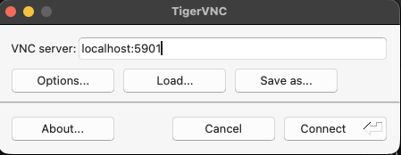
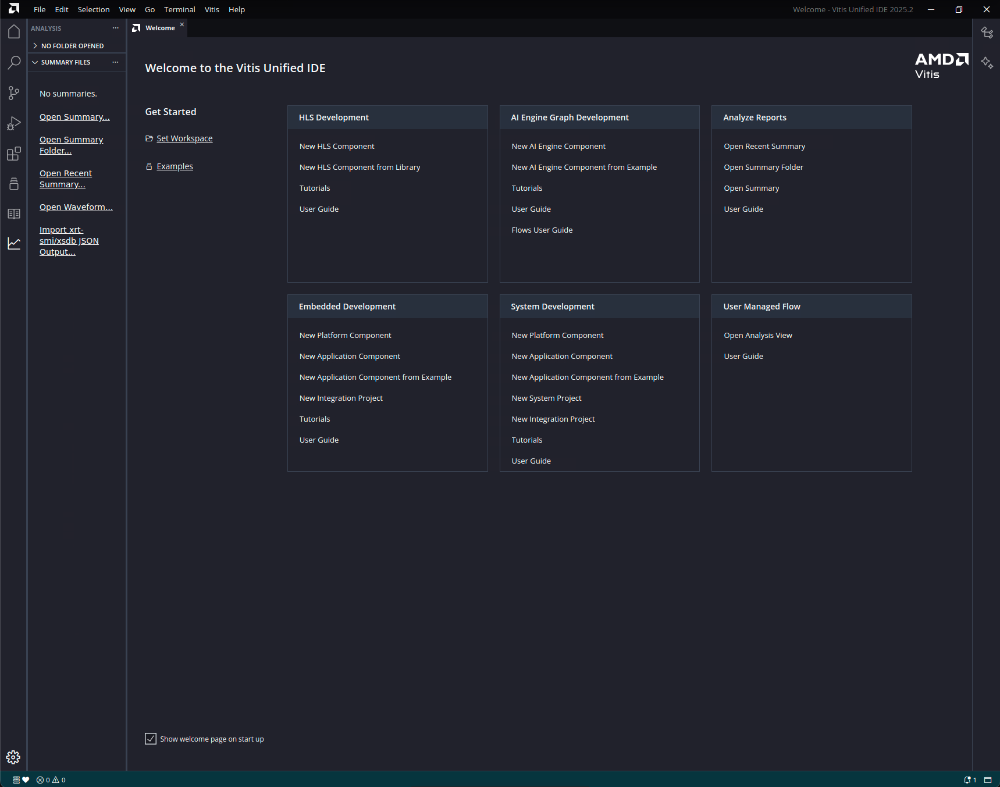

# FPL Workshop

## Schedule

### 0–15 min - Introduction to AIE4ML tutorial and demo

 - Intro of the tutorial, installation notes, etc.
 - Demo on the Board
    - MLP Mixer (Dimitrios)
    - Transformer (ViT layer 1)

### 15–30 min — Introduction to Ryzen AI tutorial

- Brock will give the introdcution with setup instruction

## Hands-On Tutorial — Detailed Steps 30-60 min 

1. **Connect to the AWS instance**

    Download the .zip file for setup
    ```bash
    curl -L -O https://raw.githubusercontent.com/kmhatre14/aie4ml/fpl_workshop/fpl_workshop.zip
    unzip fpl_workshop.zip
    cd fpl_workshop
    ssh -i fpl_aws.pem -L 5902:localhost:5902 ubuntu@ec2-52-8-195-25.us-west-1.compute.amazonaws.com # This will open a tunnel for vnc server
    ```

    5901 is the port number.


    Connect to the VNC server
    Use TigerVNC as a client or any other client of your choice
    
    TODO: Verify the windows and linux link
    
    TigerVNC viewer Download
    
    Windows: https://sourceforge.net/projects/tigervnc/files/stable/1.16.2/tigervnc64-1.16.2.exe/download
    
    Mac: https://sourceforge.net/projects/tigervnc/files/stable/1.16.2/TigerVNC-1.16.2.dmg/download
    
    Linux: https://sourceforge.net/projects/tigervnc/files/stable/1.16.2/tigervnc-1.16.2.x86_64.tar.gz/download

    Connect to the server

    ```
    Use localhost:<port> 
    We will assign a port per user, PLEASE USE THE SAME PORT FOR THE ENTIRE TUTORIAL
    ```

    

    Password is ```123456```

2. **AIE4ML is already build. Just source the env**

   ```bash
   source <Vitis settings.sh>
   source venv/bin/activate # Pre-build AIE4ML
   ```

3. **Run a tutorial as a sanity check**

   ```bash
   python fpl_tutorial.py
   ```

    Launch Vitis analyzer in another terminal 
    ```bash
   vitis_analyzer
    ```
    

    Open the summary


    The model

    ```python
    def build_model():
        inp = tf.keras.Input(batch_size=BATCH, shape=(N_IN,), name='inp')
        x = QActivation(quantized_bits(8, 0), name='input_quant')(inp)
        x = QDense(128, kernel_quantizer=quantized_bits(8, 0, alpha=1), name='dense_0')(x)
        
        x = QActivation(quantized_bits(8, 0), name='quant_0')(x)
        out = QActivation(quantized_bits(8, 0), name='quant_out')(x)
        return Model(inp, out, name='single_dense_large')
    ```

    The config

    ```python
    aie_model = hls4ml.converters.convert_from_keras_model(
        model,
        hls_config=cfg,
        output_dir='proj_aie_' + PROJECT_NAME,
        backend='aie',
        project_name='proj_aie_' + PROJECT_NAME,
        batch_size=BATCH,
        iterations=ITERS,
        part=PLATFORM,
        target='hardware',  # hardware | aie
        pl_memory='uram',  # uram | bram
        enable_pl_timing=True,  # True | False
        pl_data_mover_mode='memory_stream',  # benchmark | memory_stream | external_stream
    )
    ```


4. **Build a simple model in Keras**
   - Modify the tutorial and rerun the complete flow 
